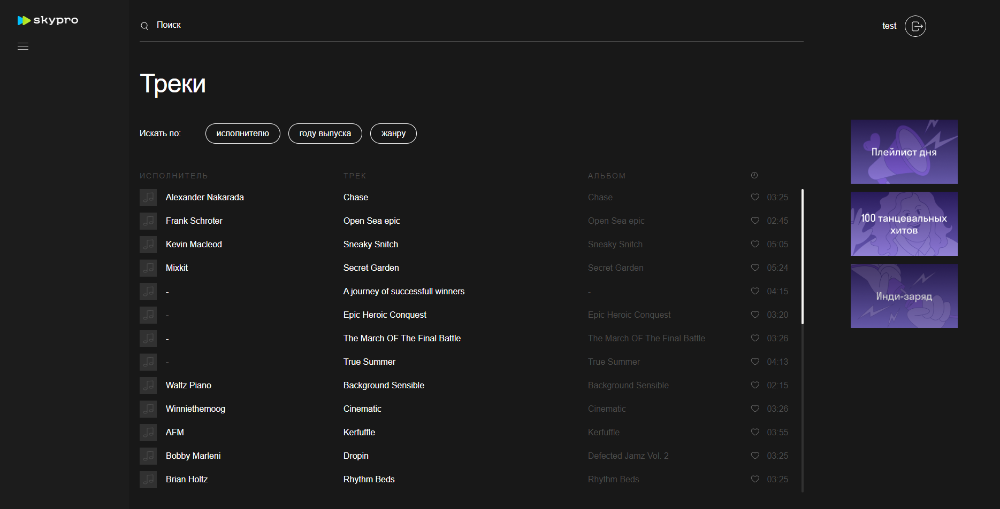
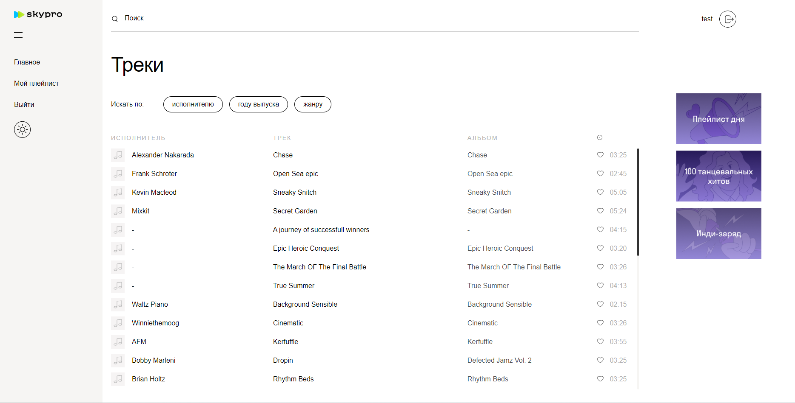
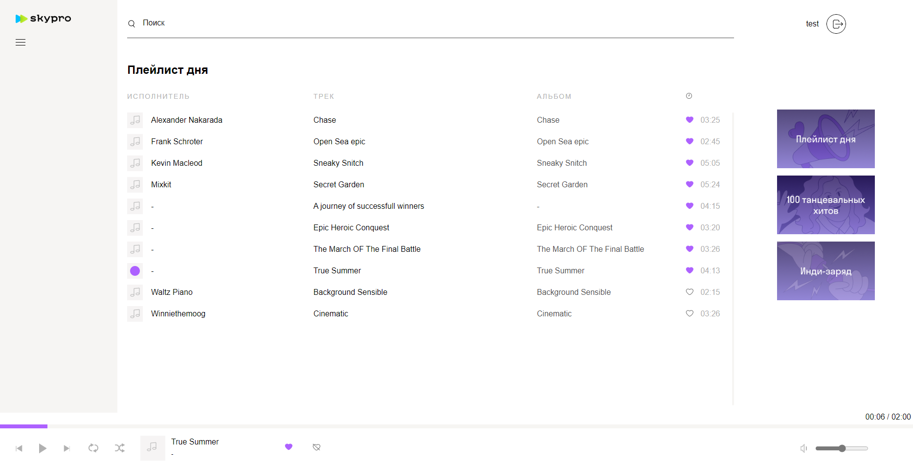
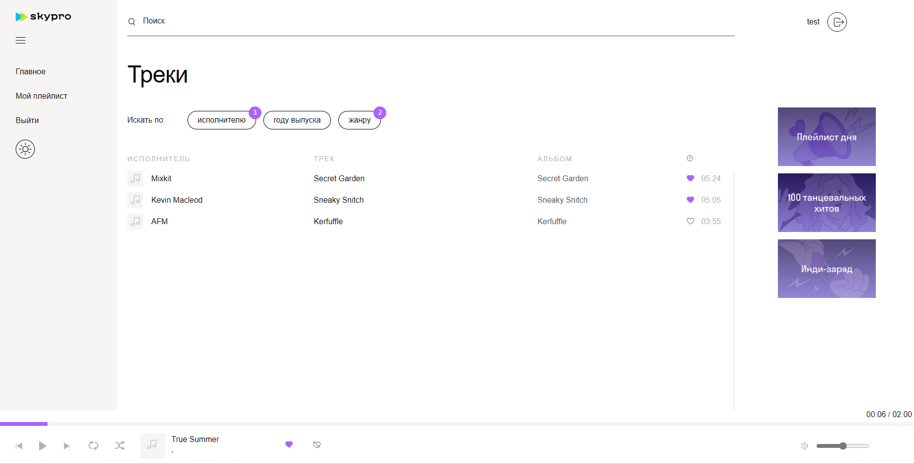

# Музыкальный плеер
Проект музыкального плеера представляет собой современное и удобное веб-приложение, предназначенное для любителей музыки.

Основные функции:
- Авторизация
- Воспроизведение треков
- Возможность добавлять треки в избранное
- Плейлисты
- Сквозной плеер, который работает на всех страницах
- Возможность поиска по названиям треков
- Фильтры по исполнителю, году и жанру
- Возможность управлять воспроизведением (пауза, воспроизведение, переключение треков, зациклить трек, перемешать треки, управление громкостью, перемтотка трека)
- Изменение темы плеера

&nbsp;
&nbsp;
&nbsp;
&nbsp;
&nbsp;

## Ссылка на готовый проект
https://flydecisive.github.io/react-music-player/

## Используемые технологии

  &nbsp;
  &nbsp;   
  &nbsp; 

## Оценка задач

### Домашняя работа по context

План: 3 дня по 2 часа = 6 часов
Факт: 2 дня по 2:47:36 и 3:40:35 соотвественно = 6:28:11

### Домашняя работа по redux

План: 10 часов
Факт: 9 часов 33 минуты 34 секунды

### Домашняя работа по redux асинхронность

План: 12 часов
Факт: 14 часов 21 минута 54 секунды

### Курсовая работа

План: 15 часов
Факт: 17 часов 42 минуты 16 секунд
